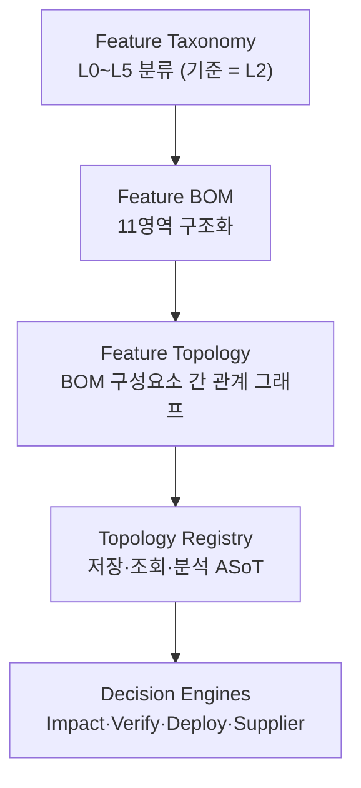

# 핵심 개념 — Feature Topology / Core Concept

## 1. 정의 방정식
> **Feature Topology = Feature BOM + Feature Modeling + Decision Context**

| 구성 | 의미 | 산출 위치 |
|---|---|---|
| **Feature BOM** | 하나의 Feature를 실현하는 **11개 영역 구성 목록** (요구사항~운영). "무엇으로 구성되나" | [[30-80-feature-bom-11-areas]] |
| **Feature Modeling** | Feature 간 **Typed Edge 관계** (parent_of/requires/excludes/fallback_to…). "어떻게 연결되나" | [[30-60-feature-edges]] |
| **Decision Context** | Variant·Control·Safety·Supplier 조건 등 **판단에 필요한 맥락**. "어떻게 판단하나" | [[40-00-rules-overview]] |

BOM은 **목록**, Topology는 **관계 + 의사결정 Context**까지 포함한다.

## 2. 계층 구조 (4 Layer)

## 3. Feature ID = 공통 Key
요구사항·SWC·ECU·API·Variant·Policy·Test·Supplier·Telemetry를 잇는 단일 외부 참조키.
모든 변경 요청은 **Topology Graph Query**로 시작한다.

## 4. 다른 도구와의 관계
ALM/PLM/Feature Flag/OTA의 산출물은 그대로 활용하되, **Feature Topology Registry가
Feature ID 기반 관계·정합성·의사결정 계층을 추가**한다. (대체 아님 — [[00-10-scope-and-non-goals]])

## 5. 다음
5가지 자동 산출물 → [[00-30-five-outputs]] · 메타모델 → [[30-00-metamodel-overview]] (사이클 13).

---
출처/근거: PPT S10,S11,S12,S22 · OMG SysML 2.0 · Graph-based Traceability.
