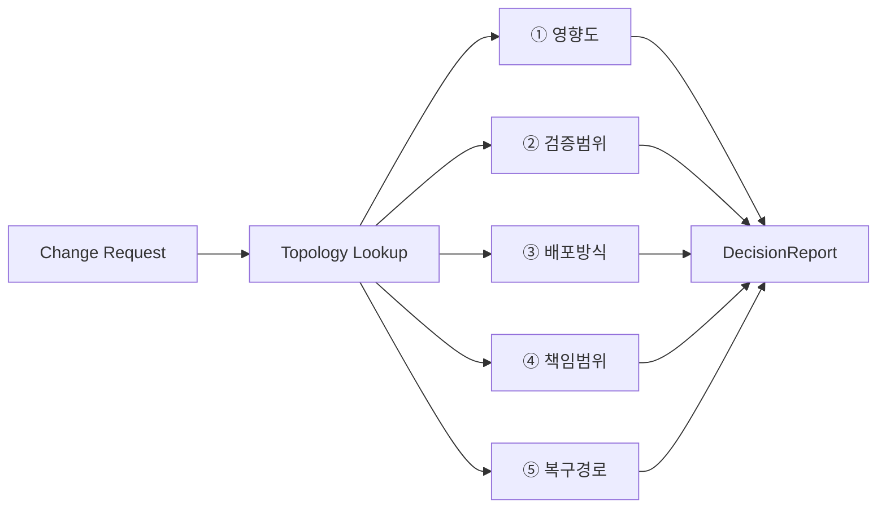

# 5대 산출물 / Five Computed Outputs

Feature Topology가 변경 요청에 대해 **자동 계산**하는 5가지. 각각 Decision Engine에 매핑된다.

| # | 산출물 | 질문 | 엔진 | 출력 |
|---|---|---|---|---|
| 1 | **영향도 분석** | 변경 시 무엇이 영향받나? | [[40-20-engine-impact]] (ENG-IMPACT) | Impacted Features·SWCs·ECUs·APIs·Variants·Tests·Suppliers |
| 2 | **검증범위 도출** | 무엇을 검증해야 하나? | [[40-30-engine-verification-scope]] (ENG-VERIFY) | Mandatory Tests·Missing Evidence·Coverage Gap·Gate Result |
| 3 | **배포방식 판단** | 어떻게 배포하나? | [[40-40-engine-deployment-decision]] (ENG-DEPLOY) | Binary OTA / Policy-only / Calibration / Manual |
| 4 | **책임범위 추적** | 누가 책임지나? | [[40-50-engine-supplier]] (ENG-SUPPLIER) | Supplier Scope·Acceptance Criteria·Contract Gap·Evidence |
| 5 | **복구경로 확인** | 실패 시 어떻게 복구하나? | (Topology fallback_to/Safe Default) | Safe Default·Rollback Plan·이전 안정 상태 |

## 의의
경험·회의 의존 판단 → **데이터 기반 의사결정 파이프라인**으로 전환.
파이프라인 상세 → [[40-50-engine-supplier]] 말미 · DecisionReport 화면 → SCR-341 (사이클 38).

---
출처/근거: PPT S12,S18,S22.
