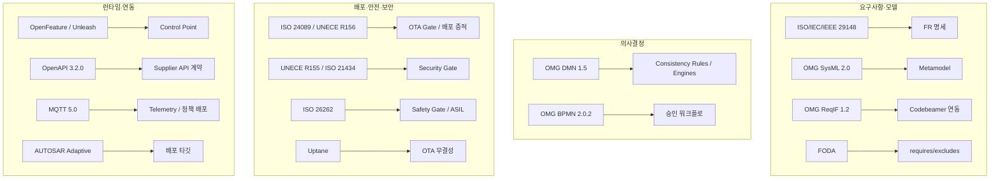

# 표준 Landscape / Standards Landscape

상세 등록부는 [[standards-register]]. 여기서는 **어느 표준이 시스템의 어느 부분을 지배하는가**를 한눈에.

## 버전 주의 (검증 완료)
- SysML **2.0** (2025-07 정식) · OpenAPI **3.2.0** (2025-09 실재) · DMN **1.5**(1.6 beta) · BPMN **2.0.2** · ISO **24089**(SAE 아님) · MQTT **5.0**.

## 매핑 사이클
보안/규제 상세 매핑 → 사이클 33([[20-50-security-architecture]]). 연동 → 사이클 47–48.

---
출처/근거: [[standards-register]] (웹 검증 2026-01).
