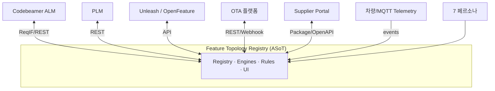
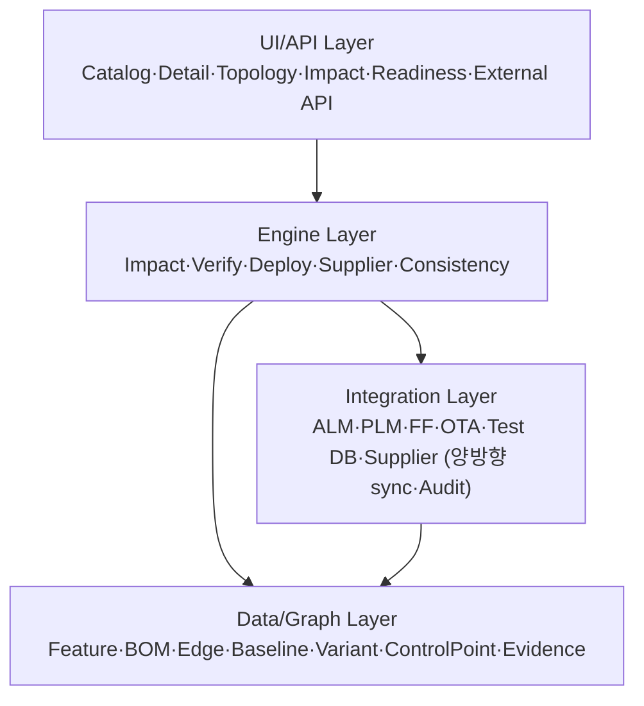

# 아키텍처 개요 (C4) / Architecture Overview

## 1. System Context (C4 L1) — ASoT 경계

ASoT는 원천을 대체하지 않고 Feature ID로 **연결·정합성·의사결정** 계층 추가.

## 2. Container (C4 L2) — 4 레이어 (PPT S13)

## 3. 1차 구현 권고 (대안 A)
PostgreSQL(SoR) + Apache AGE(그래프) 단일 ACID + 모듈러 모놀리스(NestJS) + React/Cytoscape UI. 그래프/룰/런타임을 인터페이스로 추상화 → 대안 B(Neo4j·DMN·이벤트드리븐) 진화. (계획 §11)

## 변경 이력
| 0.1.0 | 2026-06-05 | 초안 (PPT S13) |
