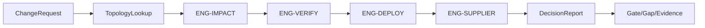

# 모듈 & 의사결정 엔진 파이프라인 아키텍처

## 1. 9 기능 모듈 → 서비스
A 기준정보 · B 토폴로지 · C Variant/Runtime · D Deploy/Verify · E Ops · F Engines · G 거버넌스 · H 연동 · I UI.
1차: 모듈러 모놀리스(단일 배포). 대안 B: F(엔진)·H(연동)를 서비스로 분리.

## 2. 엔진 파이프라인

## 3. 추상화 경계 (대안 A→B 무손실 전환)
- `GraphPort` (AGE ↔ Neo4j) · `RuleEngine` (app ↔ DMN/Drools) · `RuntimePort` (Unleash/OpenFeature).
- 연동은 outbox + webhook(이벤트드리븐 레이어)로 코어와 분리(NFR-3).

## 변경 이력
| 0.1.0 | 2026-06-05 | 초안 (PPT S18) |
