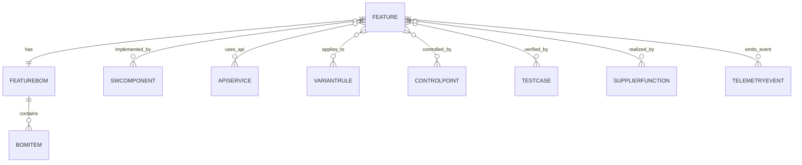

# 메타모델 개요 / Metamodel Overview (18 Entity / 4 Group)

## 1. 개요
Feature Topology Registry의 데이터 설계도. 18개 Entity를 4개 Group으로 묶고, 대표 Relationship(9종) + Typed Edge(10종)로 연결한다.

## 2. 4 Group / 18 Entity
| Group | Entities | 문서 |
|---|---|---|
| 기준정보 (Master) | TaxonomyNode, FeatureBOM, BOMItem, Requirement, **Feature** | [[30-10-master-entities]] |
| Architecture & Interface | SWComponent, ECU, APIService, Signal, DTC | [[30-20-arch-if-entities]] |
| Control & Deployment | VariantRule, ControlPoint, DeploymentUnit, RollbackPlan | [[30-30-control-deploy-entities]] |
| Verification & Operations | TestCase, TestEvidence, SupplierFunction, TelemetryEvent | [[30-40-verify-ops-entities]] |

## 3. ERD

## 4. 대표 Relationship (9) — [[30-50-relationships]]
derives · implemented_by · uses_api · applies_to · controlled_by · deployed_as · verified_by · realized_by · emits_event.

## 5. Typed Edge (10) — [[30-60-feature-edges]]
parent_of/child_of · composed_of · requires · excludes · overrides · fallback_to · degrades_to · replaces · duplicates.

## 6. 공통 설계 원칙
- 모든 엔티티는 Feature ID로 연결 가능(공통 Key).
- BOM은 원천 ID·링크만 보유(복제 금지).
- 변경은 Baseline/ChangeSet 단위로 추적([[40-80-baseline-changeset]]).

## 변경 이력
| 0.1.0 | 2026-06-05 | 초안 (PPT S14) |
