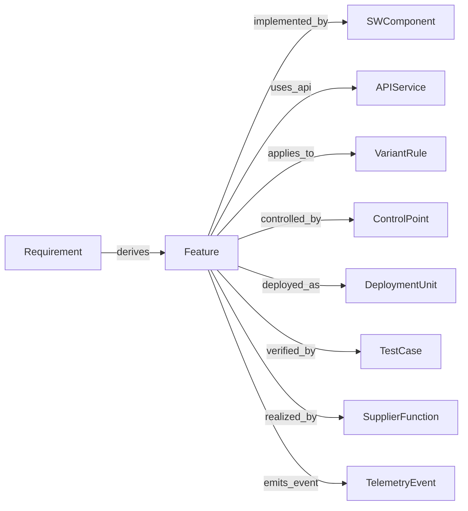

# 대표 관계 9종 / Named Relationships

엔티티 간(Feature ↔ 다른 엔티티) 의미 관계. Typed Edge(Feature↔Feature)와 구분.

| ID | 관계 | source → target | 의미 | 비고 |
|---|---|---|---|---|
| REL-DERIVES | derives | Requirement → Feature | 요구사항에서 Feature 도출 | 추적성 root |
| REL-IMPLEMENTED-BY | implemented_by | Feature → SWComponent | SW 구현 | L3 연결 |
| REL-USES-API | uses_api | Feature → APIService | API 사용 | RULE-R11 영향원 |
| REL-APPLIES-TO | applies_to | Feature → VariantRule | 적용 조건 | RULE-R07 |
| REL-CONTROLLED-BY | controlled_by | Feature → ControlPoint | 제어 수단 | RULE-R04 |
| REL-DEPLOYED-AS | deployed_as | Feature → DeploymentUnit | 배포 단위 | FR-13 |
| REL-VERIFIED-BY | verified_by | Feature → TestCase | 검증 | RULE-R03 |
| REL-REALIZED-BY | realized_by | Feature → SupplierFunction | 협력사 실현 | RULE-R06 |
| REL-EMITS-EVENT | emits_event | Feature → TelemetryEvent | 운영 이벤트 | FR-15 |

## 관계 매트릭스 (Feature 중심)

## 변경 이력
| 0.1.0 | 2026-06-05 | 초안 (PPT S14) |
