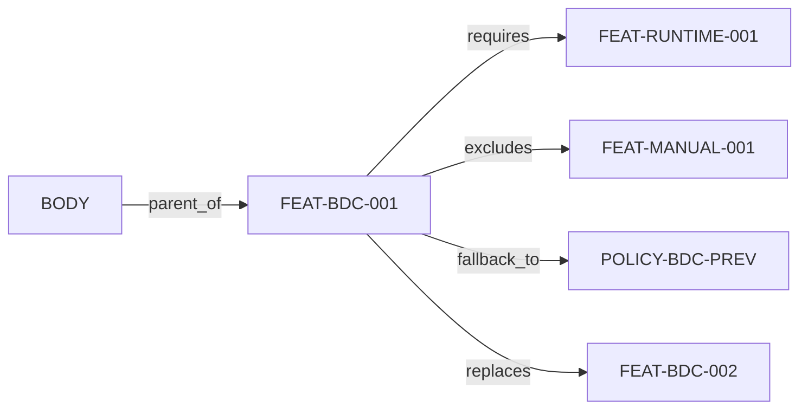

# Typed Edge 10종 / Feature Relationship Edges

## 1. Edge 공통 Schema (6 그룹)
```yaml
edge:
  Identity:   { edge_id, source_id, target_id, relationship_type }
  Semantics:  { direction, cardinality, criticality, relation_group }
  Condition:  { variant_scope, policy_condition, lifecycle_status }
  Governance: { owner_team, source_system, approval_state, baseline_ver }
  Analysis:   { impact_weight, gate_rule, evidence_link, confidence }
  Runtime:    { priority, safe_default, fallback_target, timeout }
```

## 2. 10 Edge 정의
| ID | Edge | group | 의미 / 검증 목적 | 품질룰 |
|---|---|---|---|---|
| EDG-PARENT-OF | parent_of | 구조 | 상위 분해, L0~L5 정합성 | EQ1 No-Cycle |
| EDG-CHILD-OF | child_of | 구조 | 하위 (parent_of 역) | EQ1 |
| EDG-COMPOSED-OF | composed_of | 구조 | 복합→하위 단위 구성 | — |
| EDG-REQUIRES | requires | 의존 | 활성화 선행조건·동반검증 | EQ1, EQ2 |
| EDG-EXCLUDES | excludes | 충돌 | 동시활성 금지 | EQ3 |
| EDG-OVERRIDES | overrides | 우선 | Kill/긴급정책 상위 우선 | EQ3 |
| EDG-FALLBACK-TO | fallback_to | 복구 | 정책 실패 시 복귀 | EQ4 |
| EDG-DEGRADES-TO | degrades_to | 저하 | 장애 시 safe behavior | EQ4 |
| EDG-REPLACES | replaces | 전환 | Legacy 대체·migration | — |
| EDG-DUPLICATES | duplicates | 정리 | 중복 후보 탐지 | — |

## 3. Edge 품질 규칙 (요약, 상세 [[40-10-consistency-rules]])
- EQ1 No Cycle (parent_of/requires) · EQ2 Dependency Gate (requires→Approved/Released) · EQ3 Conflict Gate (excludes/overrides→배포 차단) · EQ4 Recovery Gate (runtime→fallback/Safe Default).

## 4. 예시 — FEAT-BDC-001 (DIAG-FLW-BDC)
```yaml
- { source: FEAT-BODY-001, target: FEAT-BDC-001, type: parent_of }
- { source: FEAT-BDC-001, target: FEAT-RUNTIME-001, type: requires, criticality: high,
    gate_rule: "target must be Approved/Released" }
- { source: FEAT-BDC-001, target: FEAT-MANUAL-001, type: excludes }
- { source: FEAT-BDC-001, target: POLICY-BDC-PREV, type: fallback_to, runtime: { safe_default: disabled } }
- { source: FEAT-BDC-001, target: FEAT-BDC-002, type: replaces }
```



## 변경 이력
| 0.1.0 | 2026-06-05 | 초안 (PPT S11) |
