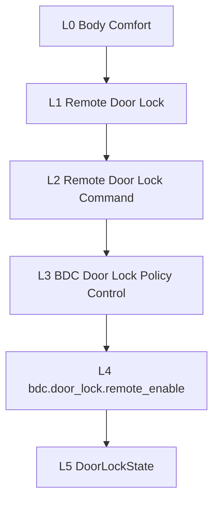

# Taxonomy L0~L5 / Level Hierarchy

## 1. 계층 (기준 = L2)
| Level | 관리 목적 | Object | 필수 연결 | 배포 대상 |
|---|---|---|---|---|
| L0 | Domain/Capability | TaxonomyNode | L1 | ✗ |
| L1 | Customer/Business | Feature Cluster | L2 | ✗ |
| **L2** | **Vehicle/System (기준)** | Feature Master | Requirement·Variant·Test | ✓ 기준 |
| L3 | Software Feature | Feature/SupplierFunction | SWC·ECU·Supplier | ✓ |
| L4 | Policy/Flag/Parameter | ControlPoint | Policy·Safe Default | (제어) |
| L5 | Code/Signal/Logic | Implementation Item | API·Signal·DTC | (구현) |

## 2. Boundary & Governance
- L0/L1: 분류·상품가치, DeploymentUnit 직접 연결 금지(T-004).
- L2: 요구사항·검증·Variant·Gate 기준 단위.
- L3: 구현·협력사 책임, L2와 trace 필요(T-003).
- L4/L5: Control/Implementation Artifact (Feature 아님).

## 3. Mermaid (Body Comfort 예시)

## 4. Consistency (T-001~T-004) → [[FR-2-taxonomy]]
## 변경 이력
| 0.1.0 | 2026-06-05 | 초안 (PPT S9) |
