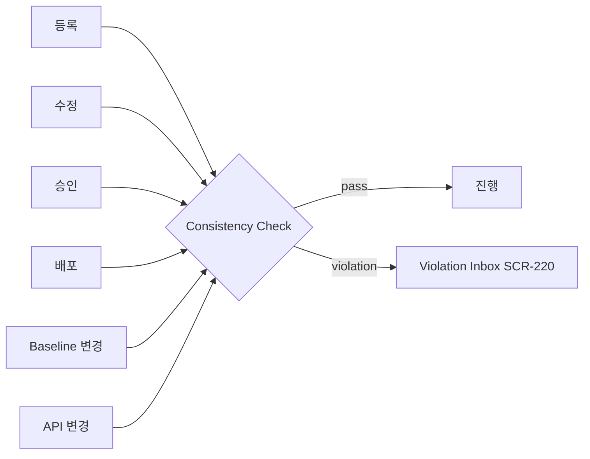

# 정합성 규칙 12종 + Edge 품질 4종

## A. Required Link
```yaml
- { rule: RULE-R01, trigger: [register,modify,approve], scope: "level==L2",
    condition: "count(requires_link of type derives)==0", severity: blocking,
    message: "L2 Feature는 최소 1개 Requirement 필요", gate: GATE-G2 }
- { rule: RULE-R02, trigger: [register,modify,approve], scope: "level==L2",
    condition: "owner_org == null", severity: blocking, message: "L2 Feature는 Owner 필수", gate: GATE-G1 }
- { rule: RULE-R03, trigger: [approve,deploy], scope: "lifecycle==Released",
    condition: "count(TestEvidence)==0", severity: blocking, message: "Released는 ≥1 Test Evidence 필요", gate: GATE-G5 }
```

## B. Runtime / Deployment
```yaml
- { rule: RULE-R04, trigger: [modify,deploy], scope: "isRuntimeControl",
    condition: "safe_default == null", severity: blocking, message: "Runtime Control은 Safe Default 필수", gate: GATE-G4 }
- { rule: RULE-R05, trigger: [deploy], scope: "deploy_type==Policy-only",
    condition: "rollback_plan == null", severity: blocking, message: "Policy-only는 Rollback Plan 필수", gate: GATE-G4 }
- { rule: RULE-R07, trigger: [deploy], scope: "any production activation",
    condition: "count(VariantRule)==0", severity: blocking, message: "Variant Rule 없으면 Production 활성화 불가", gate: GATE-G3 }
```

## C. Supplier / Change
```yaml
- { rule: RULE-R06, trigger: [modify,approve], scope: "implemented by supplier",
    condition: "supplier_function_id == null", severity: blocking, message: "Supplier 구현은 Supplier Function ID 연결", gate: GATE-G6 }
- { rule: RULE-R11, trigger: [api-change], scope: "APIService.version changed",
    condition: "always", severity: warning, action: "compute impacted Features", message: "API 변경 → 영향 Feature 자동 산출" }
- { rule: RULE-R12, trigger: [baseline-change], scope: "FeatureBOM changed",
    condition: "always", severity: blocking, action: "create ChangeSet + trigger Impact", message: "BOM Baseline 변경 → ChangeSet 기록" }
```

## D. Safety / Security / Lifecycle
```yaml
- { rule: RULE-R08, trigger: [approve,deploy], scope: "safety_impact",
    condition: "Safety Gate != PASS", severity: blocking, message: "Safety Impact는 Safety Gate 통과 필요", gate: GATE-G7 }
- { rule: RULE-R09, trigger: [approve,deploy], scope: "security_impact",
    condition: "Security Gate != PASS", severity: blocking, message: "Security Impact는 Security Gate 통과 필요", gate: GATE-G7 }
- { rule: RULE-R10, trigger: [register,modify], scope: "feature.lifecycle==Retired/Deprecated",
    condition: "new ControlPoint created", severity: blocking, message: "Deprecated → 신규 Control Point 생성 차단" }
```

## Edge 품질 규칙 (Cycle 23)
```yaml
- { rule: RULE-EQ1, name: No Cycle, scope: "edge in {parent_of,requires}",
    condition: "creates cycle", severity: blocking, message: "순환 금지" }
- { rule: RULE-EQ2, name: Dependency Gate, scope: "edge==requires",
    condition: "target.lifecycle not in [Approved,Released]", severity: blocking, message: "requires 대상은 Approved/Released" }
- { rule: RULE-EQ3, name: Conflict Gate, scope: "edge in {excludes,overrides}",
    condition: "both active in same variant/policy", severity: blocking, action: "block deploy", message: "충돌 → 배포 차단" }
- { rule: RULE-EQ4, name: Recovery Gate, scope: "isRuntimeControl",
    condition: "no fallback_to and no safe_default", severity: blocking, message: "Runtime Control은 fallback_to/Safe Default 필요" }
```

## 트리거 시점 (Mermaid)


## 변경 이력
| 0.1.0 | 2026-06-05 | 초안 (PPT S14) |
