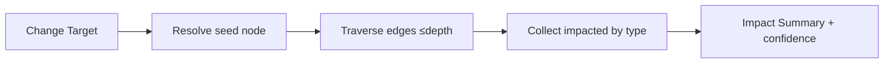

# 영향도 분석 엔진 / Impact Analysis Engine

## 1. I/O 계약
```yaml
engine: ENG-IMPACT
input:  { change_target: id, change_type: enum, depth: int(default 3) }
output:
  impacted: { features:[], requirements:[], swcs:[], ecus:[], apis:[], variants:[], tests:[], suppliers:[] }
  deployment_impact: string
  safety_security: string
  confidence: enum[High,Medium,Low]
```

## 2. 알고리즘 (그래프 탐색)
```
seed = resolve(change_target)
visited = BFS/DFS over edges {uses_api,implemented_by,realized_by,verified_by,parent_of,requires}
  up to `depth`, weighted by edge.impact_weight
collect impacted entities by type
confidence = f(edge.confidence, coverage)
```

## 3. 결정표 (요약)
| change_type | 우선 탐색 관계 | 핵심 산출 |
|---|---|---|
| API 변경 | uses_api → implemented_by → realized_by, verified_by | Features·SWC·Supplier·Tests |
| SWC 변경 | implemented_by, deployed_on | ECU·통합 Test |
| Policy 변경 | controlled_by, applies_to | Variants·Control |

## 4. Flowchart


## 5. 예시 (API-BDC-POLICY v1.4→v1.5)
출력: Features=2(FEAT-BDC-001,FEAT-BODY-001)·SWC=1·ECU=1·Supplier=1·Tests=3·Variants=4 / Policy-only 가능 / Sec Medium 재검토. (PPT S31)

## 변경 이력
| 0.1.0 | 2026-06-05 | 초안 (PPT S18,S31) |
