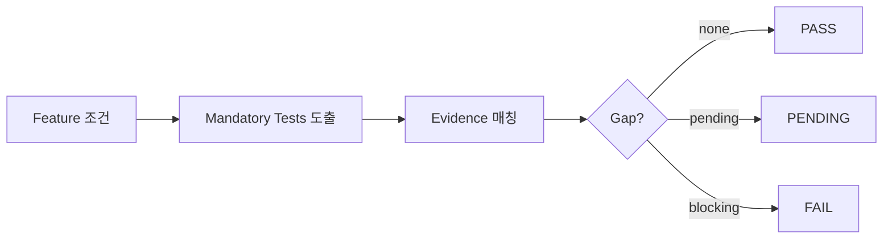

# 검증범위 도출 엔진 / Verification Scope Engine

## 1. I/O 계약
```yaml
engine: ENG-VERIFY
input: { feature_id, variant_rules, runtime_control, safety_impact, security_impact, ota_type, dependencies }
output: { mandatory_tests:[], missing_evidence:[], coverage_gap:[], gate_result: enum[PASS,PENDING,FAIL] }
```

## 2. 결정표 (조건 → 필수 검증)
| 조건 | 필수 Test |
|---|---|
| Runtime Control | Policy Apply / Fail / Rollback |
| Variant Rule | 적용/비적용 차량 |
| Supplier Function | Supplier Integration Test |
| Safety Impact | Safe Default / Degraded |
| Security Impact | Authorization / Integrity |
| OTA 연계 | Binary/Policy-only 배포 검증 |
| Telemetry | Event / Audit / DTC |

## 3. 알고리즘
```
mandatory = union(rule.tests for each matched condition)
missing = mandatory - {t | TestEvidence(t).result==pass}
coverage_gap = mandatory not covered by any evidence
gate_result = FAIL if missing(blocking) else PENDING if any pending else PASS
```

## 4. Flowchart


## 5. 예시
HIL-BDC-001(pass)·OTA-RB-002(미완)·TEL-BDC-001 → Missing=[OTA-RB-002], Gate=PENDING. (PPT S20,S25)

## 변경 이력
| 0.1.0 | 2026-06-05 | 초안 (PPT S16,S18) |
