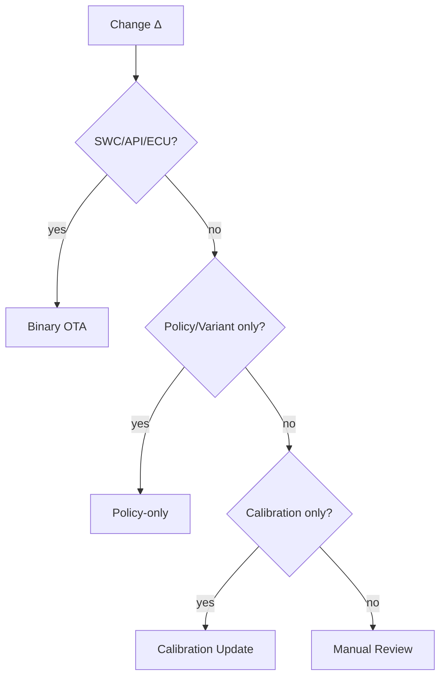

# 배포방식 판단 엔진 / Deployment Decision Engine

## 1. I/O 계약
```yaml
engine: ENG-DEPLOY
input: { change_types: list[SWC,API,ECU,Policy,Variant,Calibration] }
output: { deploy_type: enum[Binary,Policy-only,Calibration,Manual], required_gates:[], rollback_test: bool, manual_review: bool, confidence: enum }
```

## 2. 결정표 (hit policy: FIRST)
```yaml
rules:
  - { when: "SWC∈Δ or API∈Δ or ECU∈Δ", then: "Binary OTA" }
  - { when: "Policy∈Δ or Variant∈Δ (only)", then: "Policy-only" }
  - { when: "Calibration∈Δ (only)", then: "Calibration Update" }
default: "Manual Review"
```
Policy-only 추가 조건: SWC 변경 없음 ∧ API Contract 변경 없음 ∧ Runtime Context 추가 없음 ∧ Rollback 정의됨 → confidence High.

## 3. Flowchart


## 4. 예시 (Targeting Rule만 변경)
SWC/API 변경 없음 → **Policy-only**, Required Gates=[Policy,Variant,Rollback,Telemetry], confidence High. (PPT S20,S21)

## 변경 이력
| 0.1.0 | 2026-06-05 | 초안 (PPT S16,S18) |
