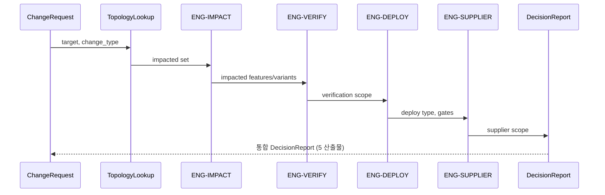

# 협력사 책임 분석 엔진 + 의사결정 파이프라인

## 1. Supplier 엔진 I/O
```yaml
engine: ENG-SUPPLIER
input: { feature_id, supplier_function, swc, api_signal_dtc_mapping }
output: { supplier_scope, acceptance_criteria, contract_gap, test_evidence_status }
```
경로: Feature → realized_by → SupplierFunction → implements → SWComponent → uses_api.

## 2. 의사결정 파이프라인 (4 엔진 통합)


## 3. DecisionReport (산출)
Impact Report + Test Scope + Deploy Decision + Supplier Report → 단일 문서. Attach to CR, Export, Submit for Approval (SCR-341).

## 4. 예시 (FEAT-BDC-001)
Supplier Scope=SUP-BDC-A · Contract Gap=none · Evidence 2/2 · API Contract 영향 없음. (PPT S20,S32)

## 변경 이력
| 0.1.0 | 2026-06-05 | 초안 (PPT S18,S32) |
