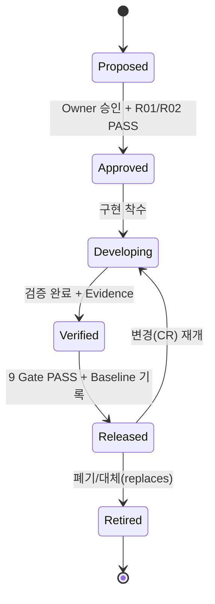
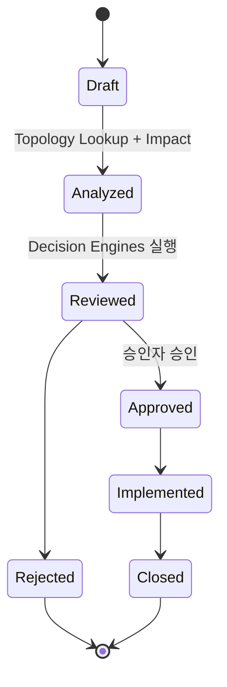
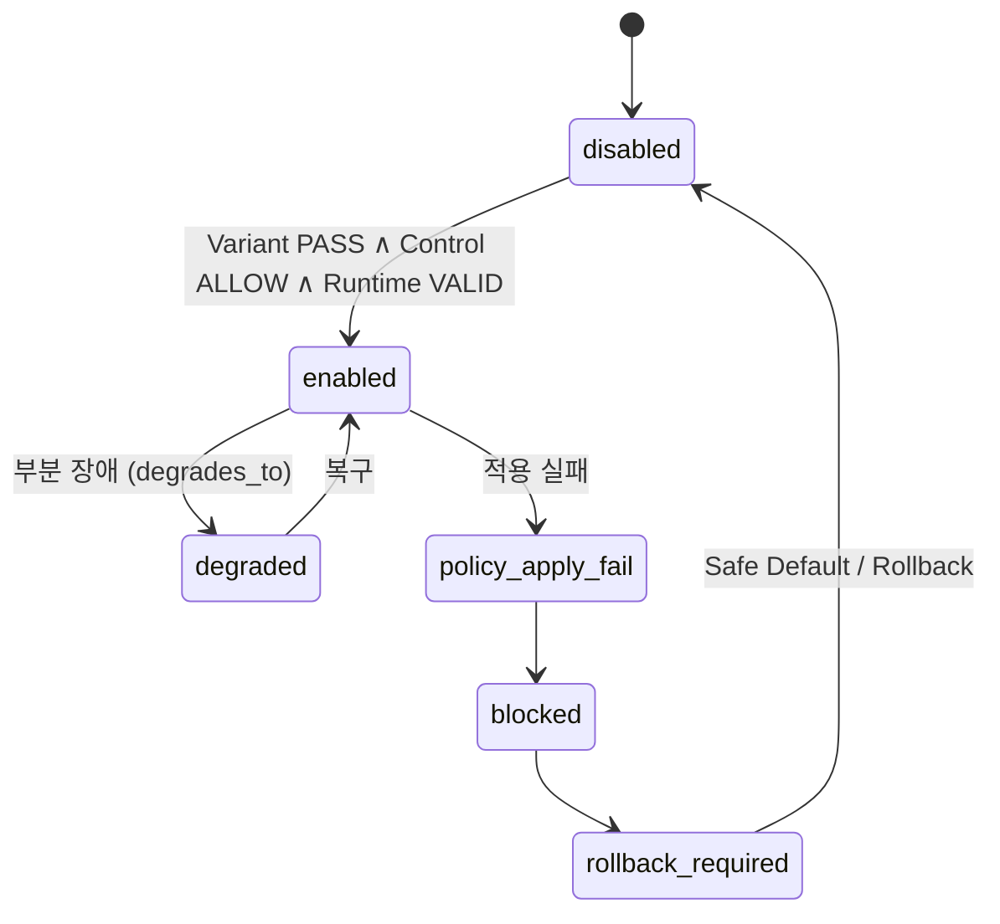

# 라이프사이클 · CR · Runtime 상태기계

## 1. Feature Lifecycle (6 상태)
전이 가드 = Gate 통과 + Owner 승인 + ChangeSet 기록 + Baseline 갱신 + Evidence 연결.

**Released 상태에서만 Production ON.**

## 2. Change Request (CR) 상태

## 3. Runtime State

## 변경 이력
| 0.1.0 | 2026-06-05 | 초안 (PPT S15,S26,S37) |
