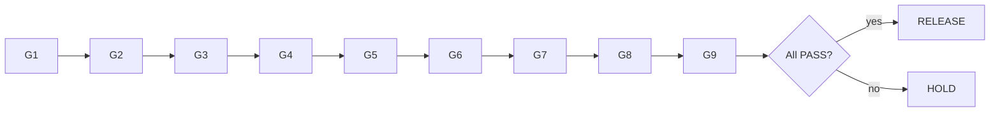

# Release Readiness 9 Gates

## 1. Gate 정의
```yaml
gates:
  - { id: GATE-G1, name: Feature,          inputs: [owner,lifecycle], pass: "Owner 지정 ∧ lifecycle≥Approved", evidence: "Feature Master", blocking: true, rule: R02 }
  - { id: GATE-G2, name: Requirement,      inputs: [requirement_links], pass: "≥1 Requirement trace", evidence: "Req Trace", blocking: true, rule: R01 }
  - { id: GATE-G3, name: Variant,          inputs: [variant_rules], pass: "Applicability Rule 유효", evidence: "Variant Matrix", blocking: true, rule: R07 }
  - { id: GATE-G4, name: Control,          inputs: [safe_default,rollback,kill], pass: "Safe Default ∧ Rollback ∧ Kill available", evidence: "Control", blocking: true, rule: "R04,R05" }
  - { id: GATE-G5, name: Verification,     inputs: [test_evidence], pass: "Mandatory Tests 완료·Missing 0", evidence: "Test Evidence", blocking: true, rule: R03 }
  - { id: GATE-G6, name: Supplier,         inputs: [supplier_function,package], pass: "Supplier 매핑·API Contract 영향 확인", evidence: "Supplier Package", blocking: true, rule: R06 }
  - { id: GATE-G7, name: Safety/Security,  inputs: [asil,security], pass: "Safety/Security Gate PASS", evidence: "ASIL/CS claim", blocking: true, rule: "R08,R09" }
  - { id: GATE-G8, name: OTA,              inputs: [deploy_type], pass: "배포 채널·방식 확정", evidence: "Deploy Decision", blocking: true }
  - { id: GATE-G9, name: Operations,       inputs: [telemetry,audit,alert], pass: "Telemetry·Audit·Alert 준비", evidence: "Ops", blocking: true }
```

## 2. 평가 로직
```
result(gate) ∈ {PASS,PENDING,FAIL}
decision = RELEASE if all PASS else HOLD
```

## 3. Mermaid


## 4. 예시 (FEAT-BDC-001)
8 PASS / G5 Verification PENDING(OTA-RB-002 미완) → **HOLD**. (PPT S25)

## 변경 이력
| 0.1.0 | 2026-06-05 | 초안 (PPT S25) |
