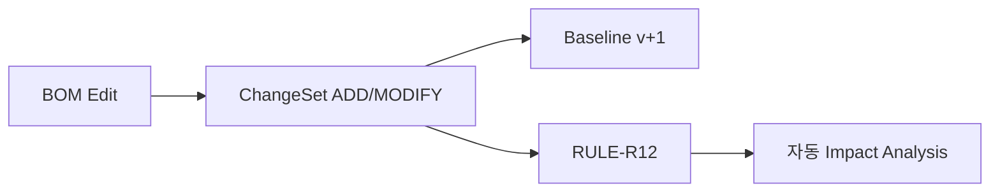

# Baseline & ChangeSet 모델

## 1. 개념
- **Baseline** = 특정 시점 Feature BOM 스냅샷(버전). valid-time 스냅샷으로 모델링(대안 B: bitemporal).
- **ChangeSet** = Baseline 간 delta(ADD/MODIFY/REMOVE × 11영역). 승인 대기 변경.
- **Audit** = system-time 불변 이력(FR-24).

## 2. ChangeSet 스키마
```yaml
changeset:
  id: CS-{FEATURE}-{from}->{to}
  entries:
    - { type: ADD|MODIFY|REMOVE, area: <11영역>, artifact_id, detail }
  triggers: [Impact Analysis (RULE-R12)]
```

## 3. 예시 (FEAT-BDC-001 v1.0→v1.1, PPT S40)
```yaml
- { type: ADD, area: Requirement, detail: "SEC-POLICY-004" }
- { type: ADD, area: Architecture, detail: "SWC-POLICY-EVALUATOR" }
- { type: ADD, area: Architecture, detail: "ECU-CCU" }
- { type: MODIFY, area: Variant, detail: "KR → KR/EU" }
- { type: ADD, area: Control, detail: "POLICY-BDC-KILL-SWITCH" }
- { type: ADD, area: Verification, detail: "OTA-ROLLBACK-002, TEL-BDC-001" }
- { type: MODIFY, area: Supplier, detail: "API Contract v1.4 → v1.5" }
# ADD 5 · MODIFY 2 → Impact Analysis 자동 트리거
```

## 4. Mermaid


## 변경 이력
| 0.1.0 | 2026-06-05 | 초안 (PPT S40) |
