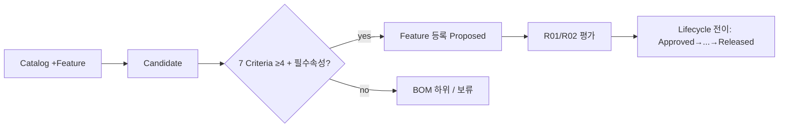

# Feature 등록(7-criteria) & 라이프사이클 플로

## 클릭 시나리오
| # | 화면 | 행동 | 시스템 반응 |
|---|---|---|---|
| 1 | SCR-100 | `+ Feature` | SCR-130 Wizard 진입 |
| 2 | SCR-130 | Candidate 입력 | step1 저장 |
| 3 | SCR-130 | 7 Criteria Evidence 토글 | 충족 수 카운트 |
| 4 | SCR-130 | 필수 속성 입력 | Owner/Verification/Applicability 검증 |
| 5 | SCR-130 | 등록 결정 | ≥4+필수→Feature(Proposed) / 미달→BOM 하위·보류 |
| 6 | SCR-101 | — | RULE-R01/R02 평가, Detail 진입 |

## Mermaid

## 라이프사이클 전이 (가드)
Proposed→Approved→Developing→Verified→Released→Retired. 각 전이 = Gate+승인+ChangeSet+Baseline+Evidence. (→ [[40-60-lifecycle-state-machine]])
