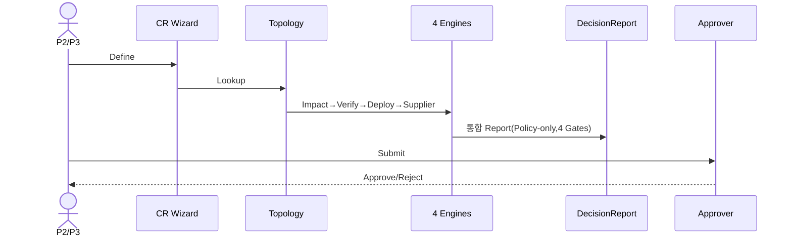
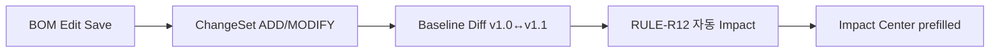

# CR & ChangeSet→자동 Impact 플로

## (ii) CR 파이프라인
| # | 화면 | 행동 | 반응 |
|---|---|---|---|
| 1 | SCR-101 | QA `Create CR` | SCR-410 Wizard |
| 2 | SCR-410 | Define(target/type) | step 검증 |
| 3 | SCR-410 | Topology Lookup | 영향 미리보기(SCR-300 재사용) |
| 4 | SCR-410 | Run Decisions | Impact/Verify/Deploy/Supplier 자동 |
| 5 | SCR-341 | Review Report | 통합 DecisionReport |
| 6 | SCR-410 | Submit | SCR-A20 승인자 라우팅 |

## (vii) ChangeSet→Baseline Diff→자동 Impact

