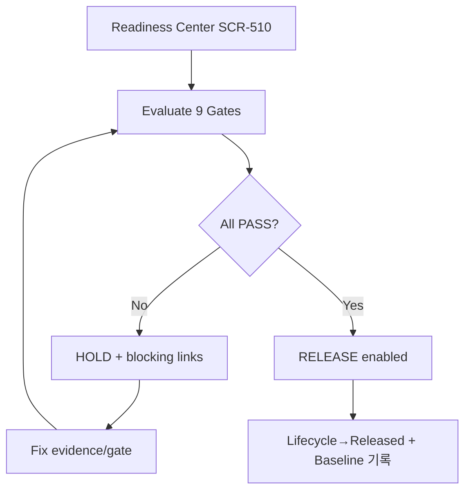
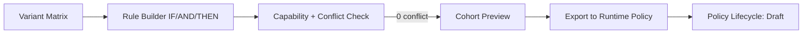

# Release Readiness & Variant 작성 플로

## (iii) Release Readiness 9-Gate

BDC 예시: 8 PASS, ⑤Verification PENDING(OTA-RB-002) → HOLD → 완료 후 재평가 → RELEASE.

## (iv) Variant 규칙 작성→Export to Policy

Variant(구조) → Export → Control(운영) 분리 유지. `deploy` verb.
