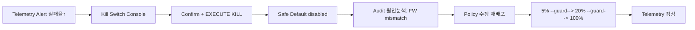

# Kill Switch → Safe Default → 단계 복구 플로 (QW-2)

## 클릭 시나리오
| # | 화면 | 행동 | 반응 |
|---|---|---|---|
| 1 | SCR-620 | 이상 감지(실패율 3%→15%) | Alert→Incident |
| 2 | SCR-650 | Kill 진입·type-confirm·EXECUTE | 전체 차량 즉시 비활성화 |
| 3 | — | Safe Default 적용 | disabled 복귀·안전 확인 |
| 4 | SCR-641 | 원인 분석(Audit) | ECU FW mismatch |
| 5 | SCR-610 | Policy 수정·재배포 | Draft→Deployed |
| 6 | SCR-650 | 단계 복구 5→20→100 | 단계 guard(telemetry 임계) |

## Demo 구현 항목 (PoC, S41)
CCS→HPVC 정책 전달(REST→MQTT) · Jetson Feature Evaluator · `/cmd/kill-switch` MQTT · ECU 기본값 복귀(CAN) · Dashboard 실시간 · CCS 5/20/100 단계 제어.
