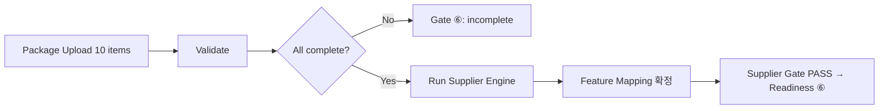
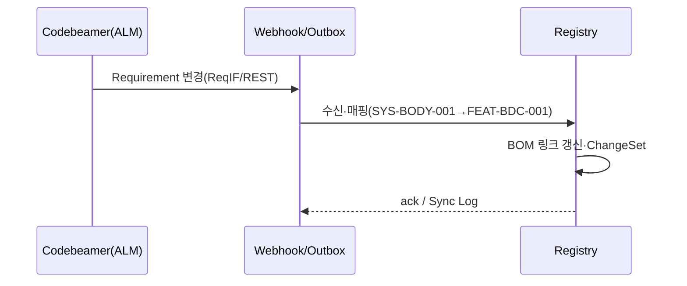

# Supplier 패키지 인수 → Gate 플로 + 연동 sync

## (vi) Supplier 패키지 인수

```mermaid
flowchart LR
  A[Package Upload 10 items] --> B[Validate]
  B --> C{All complete?}
  C -->|No| D[Gate ⑥: incomplete]
  C -->|Yes| E[Run Supplier Engine]
  E --> F[Feature Mapping 확정]
  F --> G[Supplier Gate PASS → Readiness ⑥]
```

## 연동 sync (Codebeamer 예시)

```mermaid
sequenceDiagram
  participant CB as Codebeamer(ALM)
  participant W as Webhook/Outbox
  participant R as Registry
  CB->>W: Requirement 변경(ReqIF/REST)
  W->>R: 수신·매핑(SYS-BODY-001→FEAT-BDC-001)
  R->>R: BOM 링크 갱신·ChangeSet
  R-->>W: ack / Sync Log
```
충돌 해소: source-of-record 우선·timestamp·수동 검토 큐(SCR-810).
