# 협력사 SDV 전환 플레이북
### 왜 협력사의 SW 개발체계·납품방법이 바뀌어야 하는가 — 그리고 협력사용 Feature Platform으로 OEM과 Closed Loop를 이루는 법

> 본 문서는 SDV(Software Defined Vehicle) 전환에 따라 부품 협력사(Tier-1/2)의 개발·납품·검증·운영 체계가 어떻게 바뀌어야 하는지를 **경영(A) → 실무(B) → 납품 패키지 설계(C) → OEM 승인 Gate(D) → 운영 프로세스(E) → 실행 로드맵(F)** 순으로 정리한 전략·실행 가이드다.
> 관통 명제: **"협력사도 자체 Feature Platform(협력사용)을 구축하여, OEM의 Feature Topology 플랫폼과 요구→설계→납품→검증→운영→피드백이 순환하는 Closed Loop를 이뤄야 한다."**

---

## 0. 핵심 그림 — OEM ↔ 협력사 Closed Loop

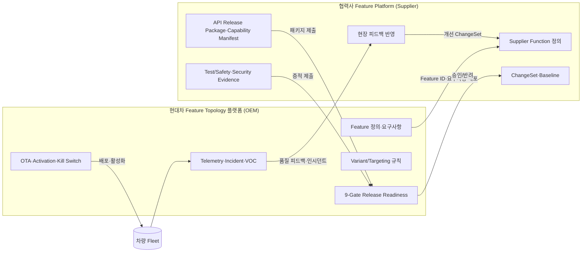

핵심: 과거 "도면/부품을 한 번 납품"하던 **단방향·일회성** 거래가, SDV에서는 "Feature를 정의·구현·검증·운영하며 지속 갱신"하는 **양방향·상시 연결(Closed Loop)**로 바뀐다. 이 연결의 양 끝단이 OEM Feature Topology와 협력사 Feature Platform이다.

---

# A. 경영 관점 — 왜 협력사 체계가 바뀌는가

## S1. Executive Message

**한 줄 메시지:** *"부품을 납품하던 회사에서, Feature를 책임지는 회사로."*

SDV는 차량 가치를 하드웨어가 아니라 **소프트웨어로 정의되는 기능(Feature)**으로 옮긴다. OEM은 더 이상 "ECU 한 박스"를 사는 것이 아니라, **OTA로 갱신·활성화·회수 가능한 기능과 그 근거(증적)**를 산다. 따라서 협력사의 경쟁력은 "원가·납기·품질의 3축"에서 **"기능 정의력 · API 호환성 · 증적/추적성 · 운영 대응력"**으로 확장된다.

경영진이 지금 결정해야 할 것:
- **투자:** 협력사용 Feature Platform(요구·API·증적·변경관리) 구축 — 비용이 아니라 **수주 자격(license to bid)**.
- **조직:** 부품 BU 중심 → Feature/SW 제품팀 + DevOps + 보안(PSIRT) 신설.
- **계약 대응:** Feature 단위 SLA·OTA 책임·사이버보안(R155/R156) 분담을 협상할 역량.
- **속도:** OEM의 SOP가 아니라 **상시 릴리스(연중 변경)**에 맞춘 파이프라인.

> 미루면 "단가 후려치기 대상"이 되고, 먼저 가면 "OEM이 같이 설계하는 전략 파트너"가 된다.

## S2. SDV 전환이 요구하는 5대 변화

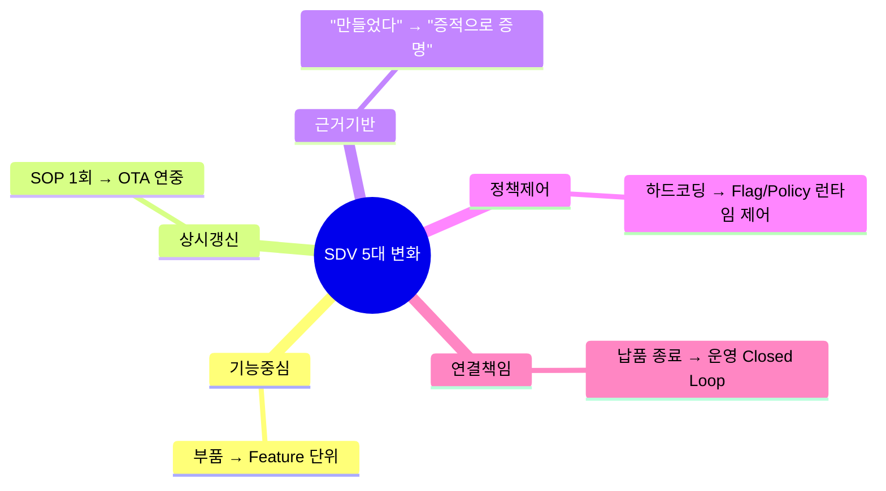

| # | 변화 | As-Was (내연/전통) | To-Be (SDV) |
|---|---|---|---|
| 1 | **단위** | 부품/ECU 박스 | 고객가치 기능(Feature) + 그 SW Function |
| 2 | **시점** | SOP 1회 납품 후 종료 | 양산 후에도 OTA로 연중 갱신·회수 |
| 3 | **근거** | 시험성적서(샘플) | 추적 가능한 Evidence(요구↔설계↔검증↔운영) |
| 4 | **제어** | 사양 고정(하드코딩) | Feature Flag/Policy로 차종·지역·시점별 활성화 |
| 5 | **관계** | 단방향 공급 | 양방향 Closed Loop(텔레메트리·VOC 환류) |

## S3. 수용하지 못할 때의 사업 리스크

| 리스크 영역 | 구체 증상 | 사업 영향 |
|---|---|---|
| **수주 자격 상실** | RFQ의 SW/사이버보안/증적 요건 미충족 | 입찰 자체 탈락(license to bid 박탈) |
| **단가 압박 가속** | "기능 책임 못 짐" → 단순 가공업체로 분류 | 마진 잠식, 대체 가능 부품화 |
| **승인 지연·페널티** | OEM Gate(증적·API·보안) 반복 반려 | SOP 지연·지체상금, 신뢰도 하락 |
| **리콜·법규 노출** | UNECE R155/R156 미준수, OTA 추적 불가 | 형식승인 차질·리콜 비용·법적 책임 |
| **운영 단절** | 양산 후 인시던트 대응 불가(Closed Loop 부재) | 필드 이슈 장기화, 차기 수주 배제 |

> 요지: **"못 바꾸면 비용이 아니라 시장에서 사라지는 문제"**가 된다.

## S4. OEM이 요구하는 협력사 역량 모델

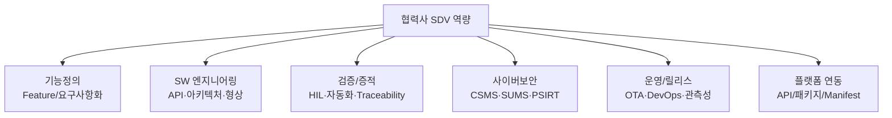

| 역량 | 최소 기대 수준 | 증명 방법 |
|---|---|---|
| 기능 정의 | OEM Feature ID에 대응하는 Supplier Function 정의·문서화 | Capability Manifest |
| SW 엔지니어링 | 버전드 API(OpenAPI/Protobuf), 형상관리, 변경관리 | API Release Package + ChangeSet |
| 검증·증적 | 요구↔테스트 추적, 자동화 회귀 | Test Evidence Package |
| 보안 | ISO/SAE 21434 CSMS, R156 SUMS, 취약점 대응 | Safety/Security Evidence |
| 운영 | OTA 호환·롤백·텔레메트리 제공 | Operations Evidence |
| 연동 | OEM 플랫폼과 API/패키지 자동 교환 | Connector 연동 검증 |

## S5. 협력사 전환 성숙도 모델 (L0~L4)

```mermaid
quadrantChart
  title 협력사 성숙도 (역량 vs 연결)
  x-axis 낮은 플랫폼 연결 --> 높은 플랫폼 연결
  y-axis 낮은 SW역량 --> 높은 SW역량
  quadrant-1 전략 파트너(L4)
  quadrant-2 역량보유·미연결(L2)
  quadrant-3 전통 협력사(L0)
  quadrant-4 연결만 됨(L1)
  "L0 부품공급": [0.15, 0.15]
  "L1 문서전자화": [0.6, 0.25]
  "L2 SW내재화": [0.3, 0.65]
  "L3 패키지자동화": [0.7, 0.7]
  "L4 ClosedLoop": [0.9, 0.9]
```

| 레벨 | 명칭 | 특징 | 납품 형태 |
|---|---|---|---|
| **L0** | 부품 공급 | SW=하드코딩, 증적=수기 | 부품 + 성적서 |
| **L1** | 문서 전자화 | 산출물 전자제출, 수동 | 파일 업로드 |
| **L2** | SW 내재화 | API·형상·검증 자동화 | 버전드 SW |
| **L3** | 패키지 자동화 | API Release Package 표준화 | 표준 패키지 |
| **L4** | Closed Loop | OEM 플랫폼과 실시간 연동·피드백 환류 | 협력사 Feature Platform 연동 |

목표: **2년 내 전 핵심 협력사 L3, 전략 협력사 L4.**

---

# B. 실무 관점 — 무엇이 바뀌는가

> 공통 형식: 각 항목을 **As-Was → To-Be**로 대조한다.

## S6. 납품 단위 변화

| | As-Was | To-Be |
|---|---|---|
| 단위 | 물리 부품/ECU | **Feature + Supplier Function + API + 증적**의 묶음(Deliverable Package) |
| 식별 | 부품번호(P/N) | OEM **Feature ID** ↔ **Supplier Function ID** 매핑 |
| 형태 | 1회 고정 | 버전드·재현 가능(Baseline 스냅샷) |

핵심: 납품은 "물건"이 아니라 **"갱신 가능한 기능 단위 + 그것이 안전·정상임을 증명하는 데이터"**다.

## S7. 계약 단위 변화

| 항목 | As-Was | To-Be |
|---|---|---|
| 계약 대상 | 부품 수량·단가 | **Feature/Function 라이선스 + SLA + OTA 유지보수** |
| 책임 기간 | 납품 시점 | 양산 후 라이프사이클 전체(운영·보안 패치 포함) |
| 정산 | 개당 단가 | 기능 구독/사용량·변경 건당·SLA 연동 |
| 분담 | 품질보증(부품) | **사이버보안(R155)·OTA(R156)·데이터** 책임 분담 명문화 |

> 신규 계약 부속서: ① API 호환성 보증 ② 취약점 대응 SLA ③ 변경 통지·승인 ④ 증적 제출 의무.

## S8. 요구사항 변화

| | As-Was | To-Be |
|---|---|---|
| 형태 | 문서(PDF) 사양서 | **머신리더블 요구사항**(ReqIF), Feature ID로 추적 |
| 추적 | 단절 | 요구↔설계↔구현↔테스트↔운영 **Traceability** 필수 |
| 변경 | 메일/구두 | ChangeSet 기반 변경관리(영향분석 자동 트리거) |

## S9. API 변화

| | As-Was | To-Be |
|---|---|---|
| 인터페이스 | 신호/핀맵 고정 | **버전드 계약 API**(OpenAPI/Protobuf), 하위호환 규칙 |
| 변경 | 임의 변경 | Semantic Versioning + **Breaking Change Gate** |
| 노출 | 문서 설명 | 기계 검증 가능한 계약 + Mock/SDK 제공 |

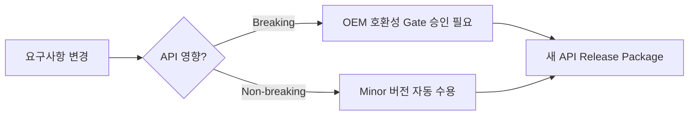

## S10. 검증 변화

| | As-Was | To-Be |
|---|---|---|
| 방식 | 샘플 시험·수기 성적서 | **자동화 검증**(HIL/SIL) + 회귀 + 커버리지 지표 |
| 산출 | 성적서 | **Test Evidence Package**(케이스↔요구 매핑·결과·커버리지·URI) |
| 시점 | SOP 전 1회 | 변경마다 상시(파이프라인 Quality Gate) |

## S11. 보안 변화

| | As-Was | To-Be |
|---|---|---|
| 체계 | 비공식 | **CSMS(ISO/SAE 21434) · SUMS(R156)** 인증 |
| 취약점 | 사후 대응 | **PSIRT** 운영, SLA 기반 패치, SBOM 제출 |
| 무결성 | 없음 | 정책/번들 **서명·검증**, 키 수명주기 관리 |

## S12. 업데이트 변화

| | As-Was | To-Be |
|---|---|---|
| 배포 | 리콜/입고 | **OTA**(무선) — 단계적 롤아웃·롤백 |
| 제어 | 불가 | Feature Flag/Policy로 **활성/비활성·Kill Switch** |
| 안전 | N/A | Safe Default·Rollback Plan 필수 |

## S13. 운영 변화

| | As-Was | To-Be |
|---|---|---|
| 관계 | 납품 후 종료 | 운영 데이터(텔레메트리) 공유·**Closed Loop** |
| 이슈 | A/S 단발 | 인시던트→원인분석→ChangeSet→재배포 순환 |
| 지표 | 불량률 | 활성화 성공률·실패율·롤백·p95 등 운영 KPI |

---

# C. Feature Topology 기반 협력사 납품 패키지 설계

## S14. Supplier Deliverable Model

협력사 납품물의 표준 단위 = **Deliverable Package**. OEM Feature 1개에 대응하는 협력사 산출물의 완전한 묶음.

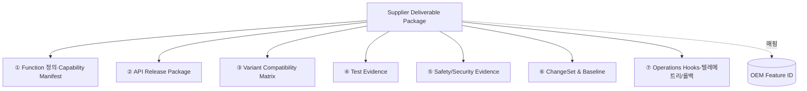

| 구성 | 내용 | OEM Gate 연계 |
|---|---|---|
| Function 정의 | Supplier Function ID·설명·의존성 | Readiness/Dev Gate |
| API Package | 계약·SDK·Mock·릴리스노트 | Development Gate |
| Variant Matrix | 적용 가능 차종·HW/SW 조건 | SOP Gate |
| Test Evidence | 검증 결과·커버리지 | Verification |
| Safety/Security | ASIL·위협분석·SBOM·서명 | Safety/Security Gate |
| ChangeSet/Baseline | 변경 내역·기준선 | 변경 승인 Gate |

## S15. OEM Feature ID ↔ Supplier Function ID Mapping

Closed Loop의 **앵커 키**. 모든 추적·증적·변경이 이 매핑을 기준으로 연결된다.

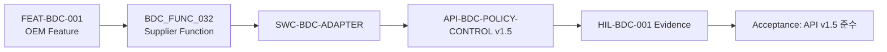

| OEM Feature ID | Supplier Function ID | API | Evidence | 상태 |
|---|---|---|---|---|
| FEAT-BDC-001 | BDC_FUNC_032 | API-BDC-POLICY-CONTROL v1.5 | HIL-BDC-001 | 매핑 완료 |
| FEAT-ADAS-001 | ADAS_FUNC_011 | API-ADAS-PERCEPTION v2.1 | HIL-ADAS-007 | 검증 중 |

규칙: **매핑 없는 산출물은 제출 불가**(고아 산출물 차단). 매핑은 양 플랫폼이 공유하는 단일 진실원(SSOT).

## S16. Supplier API Release Package (10항목)

OEM 인수의 표준 체크리스트. 10항목 전부 valid여야 Supplier Gate 통과.

| # | 항목 | 설명 | 형식 |
|---|---|---|---|
| 1 | API Contract | 인터페이스 계약 | OpenAPI/Protobuf |
| 2 | Human Documentation | 사람용 문서 | MD/PDF |
| 3 | Feature Mapping | Supplier↔OEM ID 매핑 | JSON |
| 4 | Capability Manifest | 제공 능력·제약 선언 | YAML/JSON |
| 5 | Variant Compatibility | 적용 조건 | Matrix |
| 6 | Diagnostics/Telemetry | 진단·관측 신호 | 스키마 |
| 7 | Safety/Security | 안전·보안 증적 | 문서+SBOM |
| 8 | SDK/Stub/Mock | 통합용 도구 | 패키지 |
| 9 | Test Evidence | 검증 증적 | 결과+커버리지 |
| 10 | Release Note | 변경·호환성 고지 | MD |

> 본 OEM 플랫폼의 **API Release Package** 화면이 이 10항목을 그대로 인수·검증한다(부분 미완 시 Gate 불통과).

## S17. Capability Manifest

협력사가 "무엇을 제공/제약하는가"를 **기계가 읽는 선언서**로 명시. OEM은 이를 Variant/Targeting 판정과 호환성 검사에 사용.

```yaml
# capability-manifest.yaml (예시)
supplier: SUP-BDC-A
function: BDC_FUNC_032
provides:
  - feature: FEAT-BDC-001
    api: API-BDC-POLICY-CONTROL
    version: ">=1.5.0 <2.0.0"
requires:
  hw_generation: ">=Gen3"
  sw_platform: ">=3.2.0"
  ecu: ECU-BDC
constraints:
  region: [KR, EU]          # US 미인증 → 적용 불가
  safety: QM
  rollback: supported
  safe_default: disabled
telemetry:
  - policy_apply_success
  - policy_apply_fail
```

## S18. Variant Compatibility Matrix

협력사 Function이 **어떤 차종·HW/SW 조합에서 유효한지**의 구조적 적용표(활성화 정책과는 별개 — 구조적 가능성만).

| Platform | MY | Region | Trim | HW | SW | 적용 |
|---|---|---|---|---|---|---|
| E-GMP | 2027+ | KR/EU | Premium | Gen3 | ≥3.2.0 | ✅ Allowed |
| E-GMP | 2026 | KR | Standard | Gen2 | 3.0 | 🟠 Review |
| N3 | 2027 | US | — | Gen3 | ≥3.2.0 | ⛔ Blocked(미인증) |

## S19. Supplier Test Evidence Package

| 구성 | 내용 |
|---|---|
| Test Case ↔ 요구 매핑 | 어떤 요구를 어떤 케이스가 검증하는지 |
| 방법 | HIL/SIL/실차, 자동/수동 |
| 결과·커버리지 | pass/fail, 라인/요구 커버리지 % |
| 증적 URI | 로그·리포트 위치(불변 보관) |
| Mandatory 식별 | OEM 9-Gate(G5)에서 필수인 케이스 |

> 미충족 케이스는 OEM **Verification Gate(G5) PENDING**의 직접 원인이 된다.

## S20. Supplier Safety/Security Evidence Package

| 영역 | 산출물 |
|---|---|
| 기능안전(ISO 26262) | ASIL 등급, HARA, Safety Case |
| 사이버보안(ISO/SAE 21434) | 위협분석(TARA), CSMS 증빙 |
| 업데이트(R156) | SUMS 절차, 무결성·서명 |
| 공급망 | **SBOM**, 라이선스, 알려진 취약점(CVE) 상태 |
| 운영 | PSIRT 연락·SLA, 패치 정책 |

## S21. Supplier ChangeSet & Baseline

변경은 **ChangeSet(ADD/MODIFY 묶음)**으로만 제출되며, 승인 시 새로운 **Baseline(불변 기준선)**으로 고정된다.

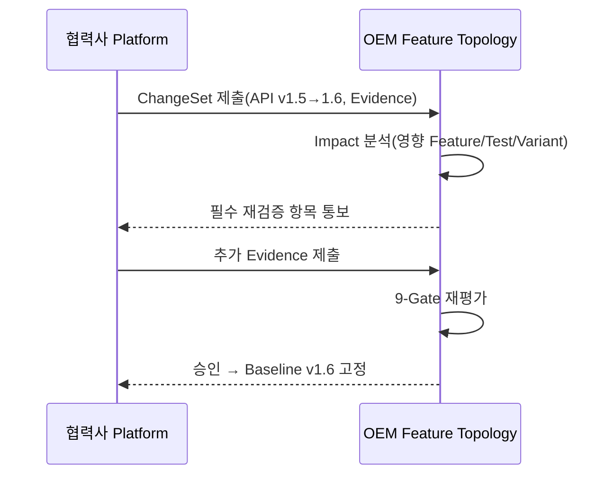

---

# D. OEM 승인 Gate — 수용하지 못하면 어디서 막히는가

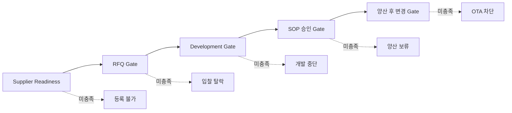

## S22. Supplier Readiness Gate (사전 자격)
- **점검:** SW 역량(L2+), CSMS/SUMS 인증, API/증적 표준 수용 가능성, 플랫폼 연동 가능성.
- **미충족 시:** 협력사 풀 등록 불가 → 애초에 RFQ를 받지 못함.

## S23. RFQ 단계 Gate
- **점검:** Capability Manifest 제출, Feature ID 매핑 가능성, 보안·OTA 책임 수용, 개략 Variant 적용성.
- **미충족 시:** 입찰 탈락 또는 조건부(역량 보완 계획 요구).

## S24. Development 단계 Gate
- **점검:** 버전드 API 계약, ChangeSet 기반 변경관리, 자동화 검증 파이프라인, 중간 Evidence.
- **미충족 시:** 개발 마일스톤 미승인 → 비용/일정 페널티, 개발 중단.

## S25. SOP 승인 Gate (양산 직전 = OEM 9-Gate)
OEM Feature Topology의 **9-Gate Release Readiness**를 그대로 통과해야 한다.

| Gate | 협력사 제출물 |
|---|---|
| G1 Feature | Function 정의·Owner |
| G2 Requirement | 요구 매핑(derives) |
| G3 Variant | Variant Compatibility Matrix |
| G4 Control | Safe Default·Rollback |
| G5 Verification | Test Evidence(필수 케이스) |
| G6 Supplier | 책임범위·인수기준 합의 |
| G7 Safety/Security | ASIL·TARA·SBOM |
| G8 OTA | 배포방식·채널 |
| G9 Operations | 텔레메트리·Alert |

- **미충족 시:** RELEASE 보류(HOLD) → 양산 활성화 불가.

## S26. 양산 이후 변경 승인 Gate
- **점검:** ChangeSet 영향분석, 회귀 증적, 호환성(Breaking 여부), 보안 영향.
- **미충족 시:** OTA 배포 차단 / 롤백 / 변경 반려.

## S27. Non-compliance 시나리오

| 시나리오 | 막히는 Gate | 결과 |
|---|---|---|
| 매핑 없는 산출물 제출 | RFQ/Dev | 제출 거부(고아 산출물) |
| API Breaking 무통지 | 변경 Gate | OTA 차단·계약 위반 |
| 필수 Test Evidence 누락 | G5(SOP) | 양산 보류 |
| SBOM/취약점 미제출 | G7 | 보안 미승인·법규 리스크 |
| 롤백/Safe Default 부재 | G4 | 활성화 불가 |

---

# E. 실무 운영 프로세스 — 협력사와 어떻게 일할 것인가

## S28. Supplier Collaboration Workflow

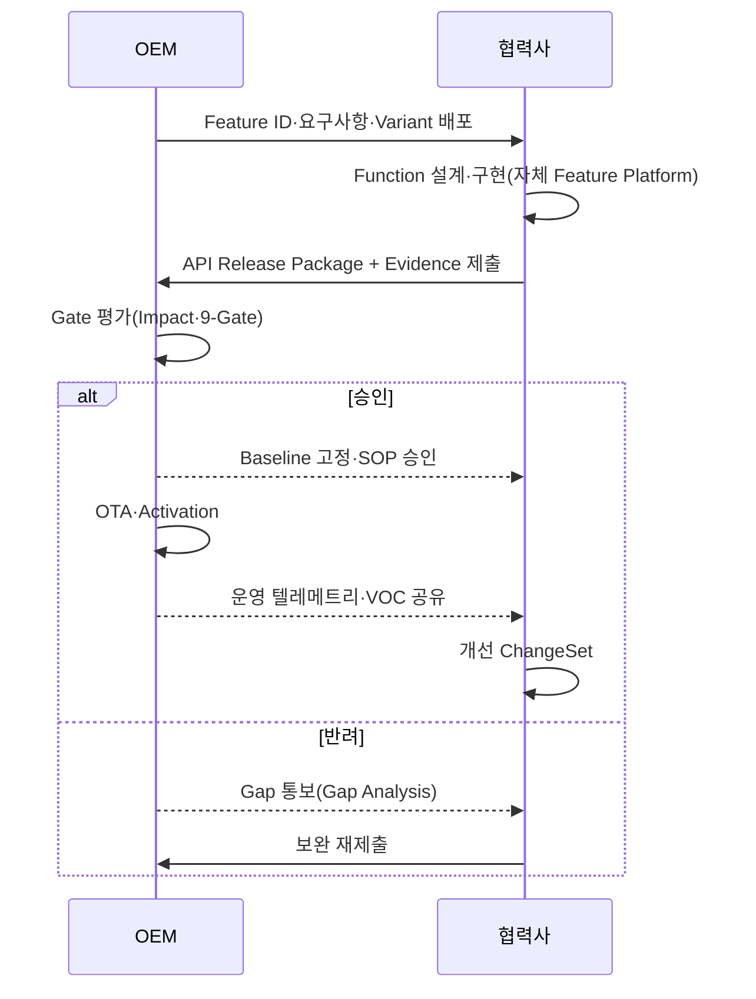

## S29. Supplier Portal IA (정보구조)

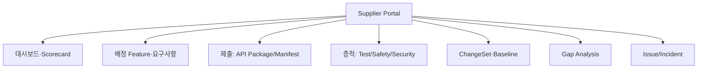

> OEM 플랫폼의 **Supplier Portal / API Release Package** 화면이 이 IA의 OEM측 대응물이며, 협력사 Feature Platform이 그 거울(mirror)이 된다.

## S30. Supplier Submission Workflow

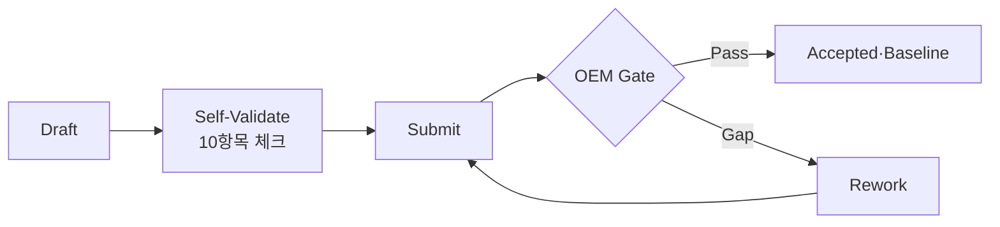

- 제출 전 **셀프 검증**(협력사 플랫폼이 10항목·매핑·서명 자동 점검) → OEM 반려율 최소화.

## S31. Supplier Gap Analysis Dashboard

| 차원 | 현재 | 목표 | Gap | 조치 |
|---|---|---|---|---|
| API 표준화 | v1.4 문서 | 버전드 계약 | 중 | OpenAPI 전환 |
| Test 자동화 | 30% | ≥80% | 대 | HIL 파이프라인 |
| 보안 인증 | 미보유 | CSMS/SUMS | 대 | 21434 도입 |
| 증적 추적성 | 수기 | 자동 매핑 | 중 | Traceability 툴 |

## S32. Supplier Scorecard (KPI)

| KPI | 정의 | 목표 |
|---|---|---|
| Gate 1-pass율 | 1회 제출 통과 비율 | ≥85% |
| Evidence 완전성 | 필수 증적 충족률 | 100% |
| API 호환성 | Breaking 사고 건수 | 0 |
| 보안 SLA | 취약점 패치 리드타임 | ≤30일(Critical ≤7일) |
| 운영 품질 | 활성화 성공률/롤백 | ≥98% / ↓ |
| 변경 리드타임 | ChangeSet→승인 | ↓ |

## S33. Supplier Responsibility Matrix (RACI)

| 활동 | OEM | 협력사 |
|---|---|---|
| Feature 정의·요구 배포 | **A/R** | C |
| Supplier Function 설계·구현 | C | **A/R** |
| API 계약 합의 | **A** | R |
| 검증 증적 생성 | C | **A/R** |
| 9-Gate 판정·승인 | **A/R** | C |
| OTA 배포·Activation | **A/R** | C |
| 취약점 대응(자사 부분) | C | **A/R** |
| 인시던트 원인분석 | C | **A/R** |

(A=Accountable, R=Responsible, C=Consulted)

## S34. Supplier Issue / Incident Loop (Closed Loop 핵심)

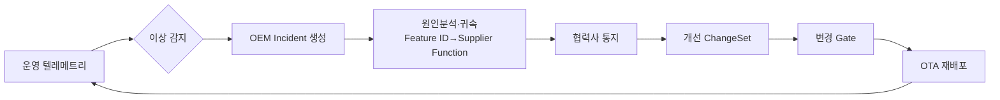

핵심: 인시던트가 **Feature ID→Supplier Function ID 매핑**을 통해 정확히 협력사로 귀속되고, 개선이 다음 ChangeSet으로 환류되어 **루프가 닫힌다.**

---

# F. 실행 로드맵 — 협력사가 어떻게 전환해야 하는가

## S35. Supplier Transformation Roadmap

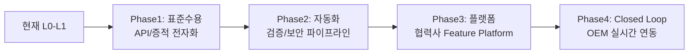

| Phase | 기간 | 목표 레벨 | 핵심 산출 |
|---|---|---|---|
| 1 표준 수용 | 0~3개월 | L1→L2 | API 계약·증적 템플릿·매핑 |
| 2 자동화 | 3~9개월 | L2→L3 | CI/CD·HIL·CSMS/SUMS |
| 3 플랫폼 | 9~18개월 | L3 | 협력사 Feature Platform 구축 |
| 4 Closed Loop | 18~24개월 | L4 | OEM 플랫폼 API 연동·피드백 환류 |

## S36. 30-60-90 Day Action Plan

| 기간 | 액션 | 산출물 |
|---|---|---|
| **30일** | 거버넌스·갭 진단·Feature ID 매핑 착수, API 인벤토리 | Gap Report, 매핑 초안 |
| **60일** | API 1종 버전드 계약화, Test Evidence 템플릿, SBOM 1종 | API Release Package(파일럿) |
| **90일** | 셀프 검증 체크리스트, Capability Manifest 제출, Readiness Gate 모의 | MVP 제출 1건 통과 |

## S37. Supplier Minimum Viable Compliance Set (MVC)

"이것만은 반드시" — 수주 자격 최소선.

- [ ] Feature ID ↔ Supplier Function ID 매핑
- [ ] 버전드 API 계약(OpenAPI/Protobuf) + Release Note
- [ ] Capability Manifest
- [ ] 필수 Test Evidence(요구 매핑·결과)
- [ ] SBOM + 취약점 상태 + 서명
- [ ] Safe Default·Rollback 정의
- [ ] ChangeSet 기반 변경 제출 능력

## S38. Target Operating Model (목표 운영 모델)

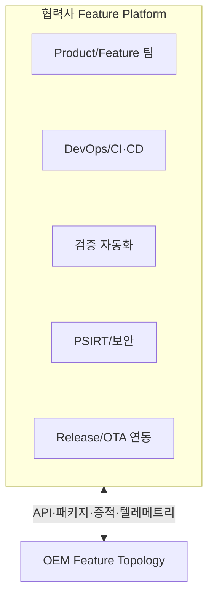

- 조직: Feature 제품팀 + 플랫폼/DevOps + 검증 + 보안(PSIRT) + OEM 연동 담당.
- 시스템: 협력사 Feature Platform(요구·API·증적·변경·관측) ↔ OEM 플랫폼 커넥터.
- 운영: 상시 릴리스·증적 자동 생성·Closed Loop 피드백.

## S39. Conclusion

- SDV 전환은 협력사에게 **위협이자 기회**다. 부품 공급자로 남으면 단가 경쟁·대체 위험, Feature 책임자로 전환하면 전략 파트너.
- 핵심 단일 과제: **협력사용 Feature Platform 구축 → OEM Feature Topology와 Closed Loop 연결.**
- 시작점은 거창한 시스템이 아니라 **MVC(S37)와 90일 플랜(S36)** — 매핑·버전드 API·증적·보안 최소셋부터.
- 측정: Gate 1-pass율·Evidence 완전성·보안 SLA·운영 품질로 전환 성과를 가시화(S32).

> **"부품을 납품하던 회사에서, Feature를 책임지고 OEM과 함께 진화하는 회사로."**

---

## 부록 — 본 Feature Topology 플랫폼과의 매핑

| 플레이북 개념 | OEM 플랫폼 화면(데모) |
|---|---|
| Supplier Deliverable / API Package(S14·S16) | Supplier Portal, API Release Package |
| Feature ID ↔ Function 매핑(S15) | Package Detail(매핑 경로) |
| 9-Gate(S25) | Release Readiness Center |
| Variant Compatibility(S18) | Variant Matrix |
| ChangeSet/Baseline(S21) | ChangeSet, Baseline Diff |
| Issue/Incident Loop(S34) | Incident Manager, Telemetry, 품질 피드백→CR |
| Scorecard/Gap(S31·S32) | (확장 예정) Supplier Scorecard |

*본 문서는 전략·실행 가이드(프로토타입 데모와 별개)이며, 정량치·ID는 예시다.*
